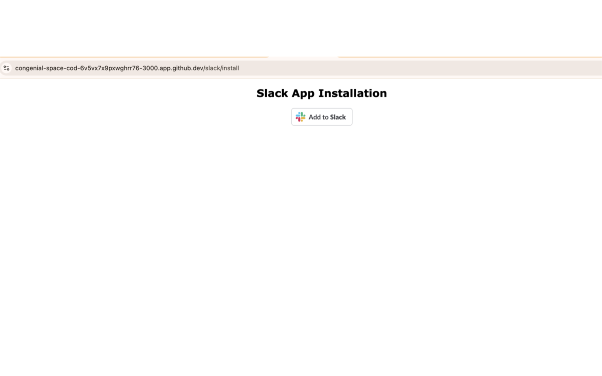
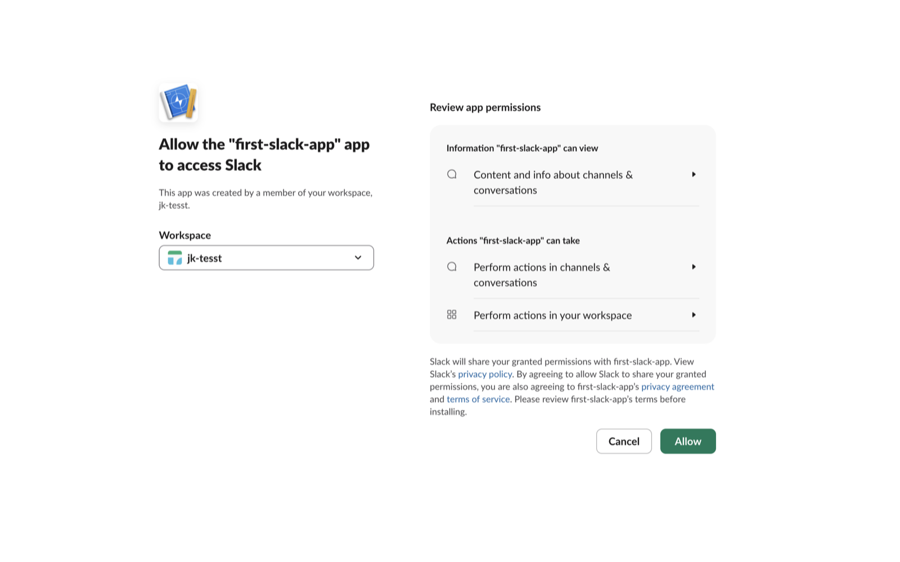
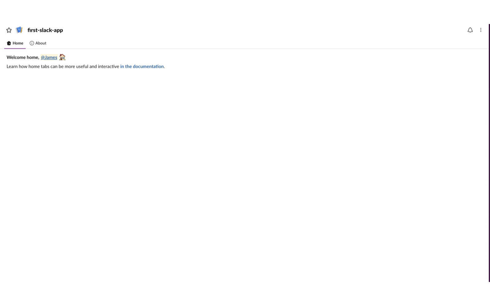
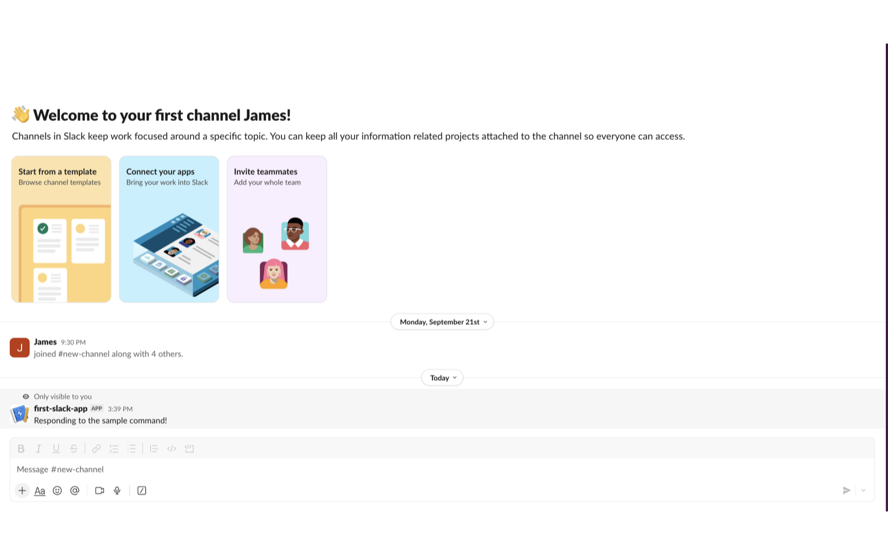
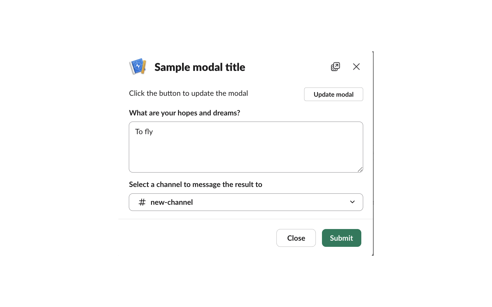
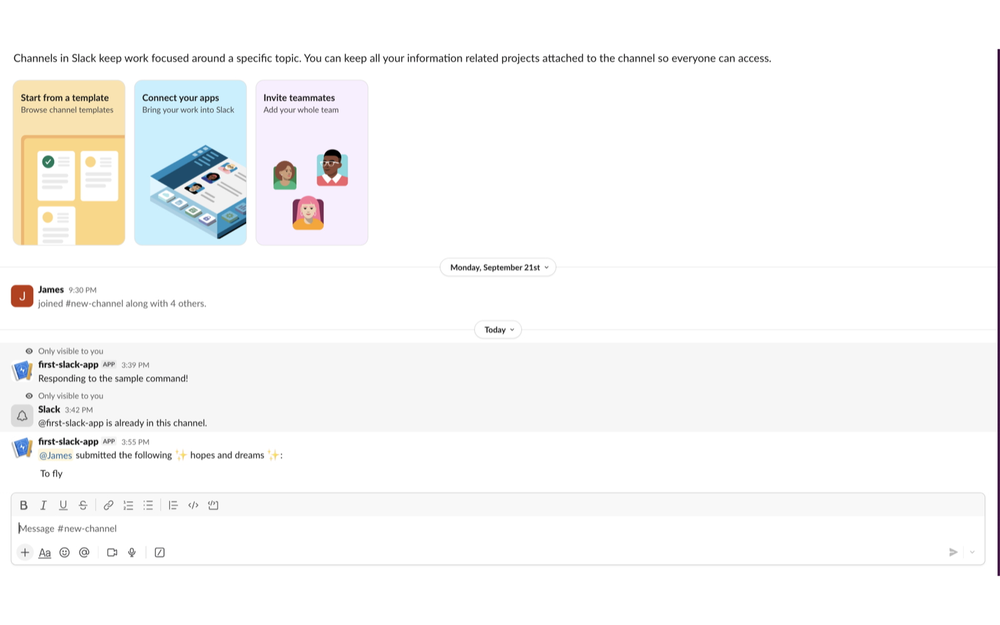
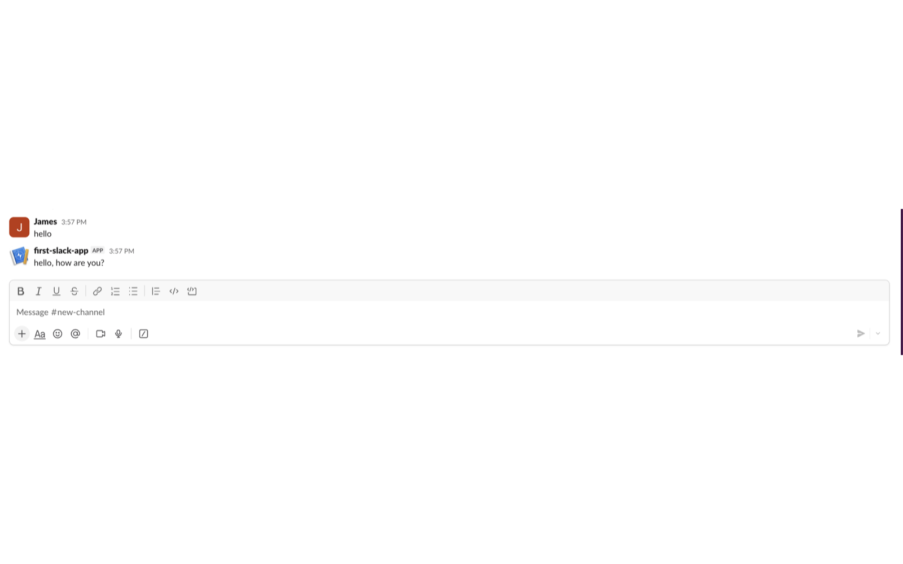

# first-slack-app screenshots

1. Install page with the Add to Slack button

2. OAuth permission screen

3. App Home welcome message

4. `/sample-command` reply

5. "Run sample shortcut" modal

6. Modal submission posted to the channel

7. Greeting reply in a channel

